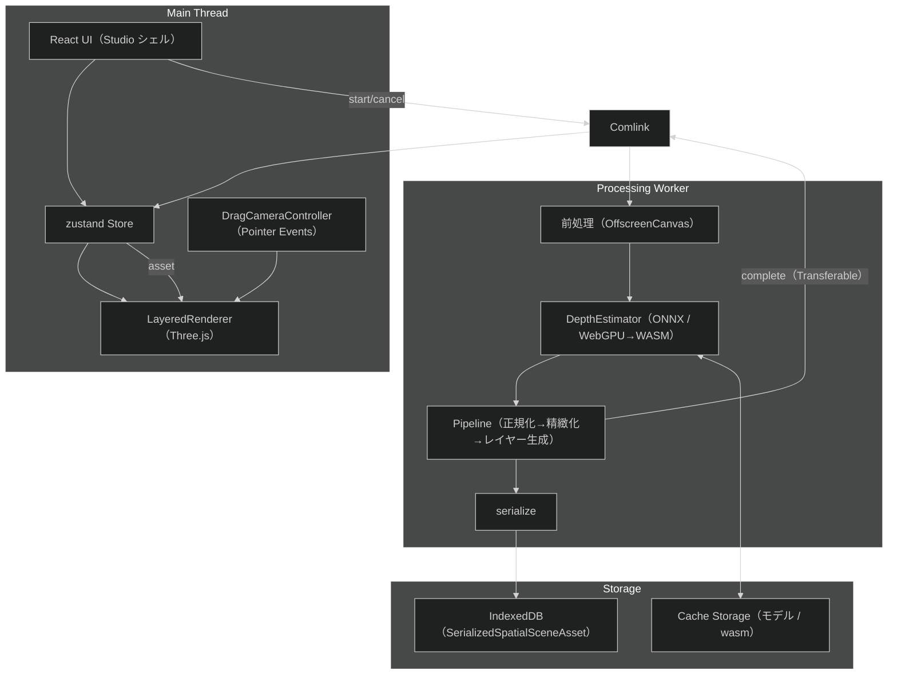

# Spatial Scene Web App 概要

最終更新日: 2026-07-03

## 1. プロジェクトの目的

1枚の画像から擬似的な空間シーンを生成し、ブラウザ上でドラッグ操作により視点移動できる Web アプリ。iOS の空間シーン機能そのものは使わず、OSS とブラウザ標準技術でクライアントサイド完結の類似体験を実装する。

## 2. 主要機能

1. **画像アップロード**: ドラッグ&ドロップ / ファイル選択
2. **深度推定**: Depth Anything V2 による単眼深度推定（ONNX Runtime Web）
3. **空間シーン**: 深度からレイヤー（前景/背景。深度が連続的な画像は単層）とメッシュを生成し Three.js で描画、ドラッグで視点移動
4. **フォールバック**: モデル未配置/推論失敗時は CSS/Canvas の簡易視差へ自動降格
5. **キャッシュ**: 同一画像は IndexedDB から即時再表示

## 3. 設計原則（実装ガイド §5 準拠）

- 最終出力は `SpatialSceneAsset` に統一する。
- ランタイム `SpatialSceneAsset` と保存用 `SerializedSpatialSceneAsset` を分離。
- 深度規約は `0.0 = far` / `1.0 = near` に統一（`normalizeDepth` の 1 箇所でのみ向きを扱う）。
- 端末性能に応じて内部解像度や分割数は調整するが、機能構成は共通にする。
- 重い処理は Web Worker（Comlink）へ分離。TypedArray は Transferable で転送。
- ONNX バックエンドは実際の `InferenceSession.create` で検証し、失敗時は WASM へフォールバック。
- Three.js の Texture / Geometry / Material は差し替え・破棄時に必ず `dispose()`。
- レイヤー補正・インペイント等は独立した処理として扱い、部分的に失敗しても処理全体を失敗扱いにしない。
- 画像差し替え・キャンセル・エラー復旧で古い処理結果を UI へ反映しない。

## 4. パイプライン概要

アップロード → 前処理 → 深度推定 → 正規化 → 精緻化 → レイヤー生成（分離度判定 → 単層 or 前景切抜 + 背景インペイント）→ メッシュ描画、という単一の流れで空間シーンを組み立てる。推論やレイヤー補完が使えない場合は CSS/Canvas の簡易視差へ降格する。詳細は [03-Pipeline.md](03-Pipeline.md)、実装状況は [05-Implementation.md](05-Implementation.md)。

## 5. 技術スタック

| カテゴリ | 技術 | 備考 |
| --- | --- | --- |
| 言語 | TypeScript | strict |
| ビルド | Vite 6 | ESM / Web Worker(ES) |
| UI | React 19 | 命令的に Three.js を駆動 |
| 描画 | three（生 Three.js / WebGL2） | React Three Fiber は不使用 |
| 推論 | onnxruntime-web（1.23 系, JSEP） | Worker で `onnxruntime-web/webgpu` を import |
| Worker 通信 | Comlink | `start` / `cancel` + Transferable |
| 画像処理 | Canvas / OffscreenCanvas | Worker 安全 |
| 状態管理 | zustand | スライス構成 |
| ストレージ | IndexedDB（idb）+ Cache Storage | 資産・モデルのキャッシュ |
| スタイル | TailwindCSS v4（`@theme` トークン） | Studio デザイン |
| テスト | Vitest | 純ロジックのユニットテスト |

深度モデル（Depth Anything V2 Base ONNX, 量子化 約97MB。より高精細な Large も選択可）は `public/models/` に配置する（入手手順は [05-Implementation.md](05-Implementation.md)）。**未配置でも CSS/Canvas フォールバックで動作**する。

## 6. アーキテクチャ全体図

