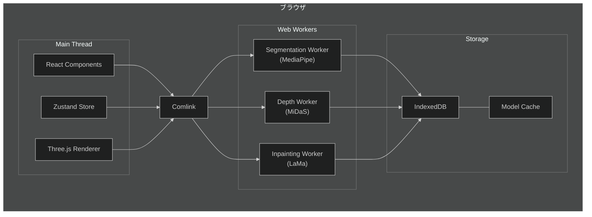
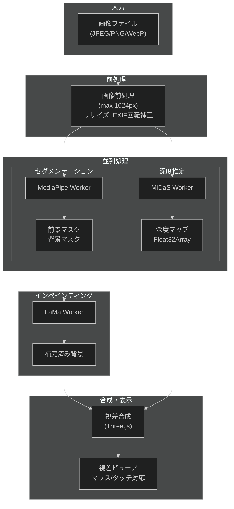

# 視差画像作成Webアプリケーション 概要

最終更新日: 2026-01-07

## 1. プロジェクトの目的

画像をアップロードし、AIによるセグメンテーション・深度推定・インペインティングを経て、インタラクティブな視差画像を作成・閲覧できるWebアプリケーション。

## 2. 主要機能

1. **画像アップロード**: ドラッグ&ドロップ、ファイル選択対応
2. **自動セグメンテーション**: 人物・物体の自動切り出し
3. **深度推定**: 単眼画像から深度マップを生成
4. **背景インペインティング**: 切り出し部分を自然に補完
5. **視差画像ビューア**: マウス/タッチ操作で3D風の視差効果

## 3. 技術要件

- **商用利用可能**: すべてのライブラリがApache 2.0またはMITライセンス
- **クライアント完結**: サーバー不要、プライバシー保護
- **レスポンシブ対応**: デスクトップ・モバイル両対応
- **軽量動作**: モバイルでも実用的な処理速度

---

## 4. 技術スタック

### 4.1 コア技術

| カテゴリ | 技術 | バージョン | ライセンス | 選定理由 |
| --- | --- | --- | --- | --- |
| ビルドツール | Vite | ^6.0.0 | MIT | 高速HMR、ESM対応 |
| UIフレームワーク | React | ^19.0.0 | MIT | コンポーネント設計、エコシステム |
| 型システム | TypeScript | ^5.7.0 | Apache 2.0 | 型安全性、開発効率 |
| スタイリング | TailwindCSS | ^4.0.0 | MIT | ユーティリティファースト、軽量 |

### 4.2 ML/AI ライブラリ

| ライブラリ | 用途 | モデルサイズ | ライセンス |
| --- | --- | --- | --- |
| @mediapipe/tasks-vision | セグメンテーション | 454KB | Apache 2.0 |
| onnxruntime-web | ML推論エンジン | - | MIT |
| MiDaS v2.1 small | 深度推定 | ~20MB | MIT |
| LaMa | インペインティング | ~208MB (FP32) / ~52MB (INT8) | Apache 2.0 |

### 4.3 レンダリング・状態管理

| ライブラリ | 用途 | ライセンス |
| --- | --- | --- |
| three | 3Dレンダリング | MIT |
| @react-three/fiber | React-Three.js統合 | MIT |
| @react-three/drei | Three.jsヘルパー | MIT |
| zustand | 状態管理 | MIT |
| comlink | Web Worker通信 | Apache 2.0 |

### 4.4 ライセンス適合性

すべてのライブラリは商用利用可能。帰属表示が必要なもの：

- Apache 2.0: NOTICE/LICENSEファイルの同梱
- MIT: 著作権表示の保持

---

## 5. アーキテクチャ

### 5.1 全体構成図

### 5.2 データフロー

