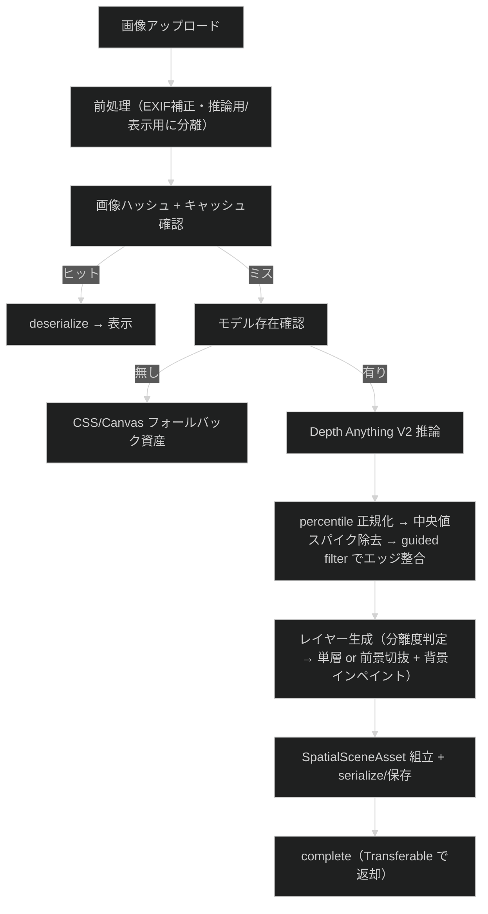
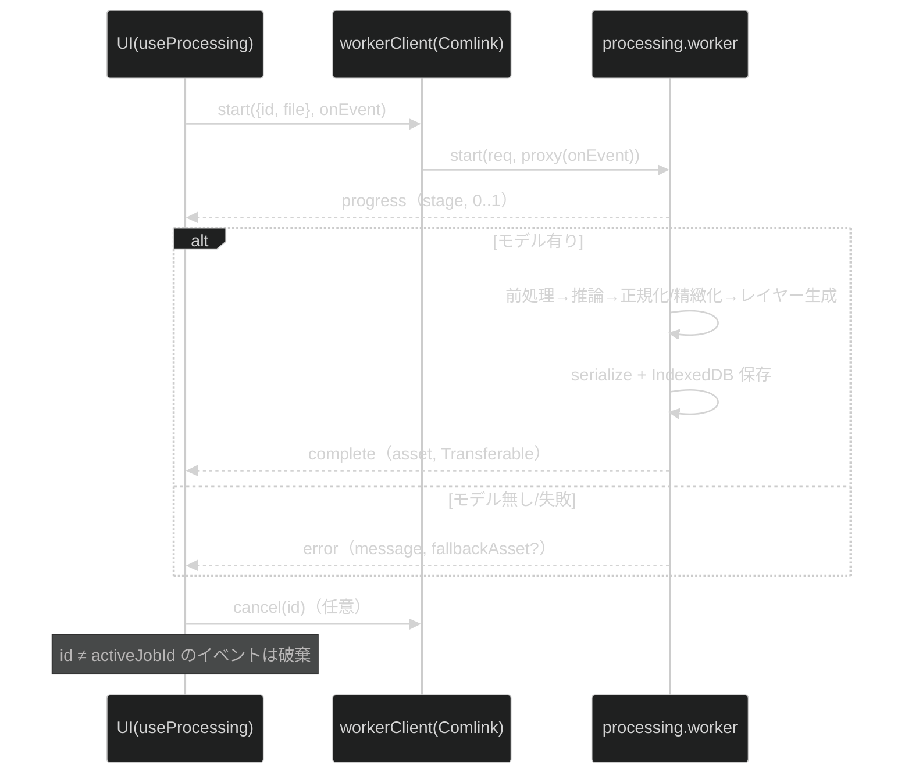
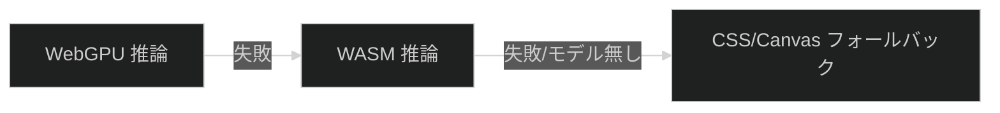

# 処理パイプライン詳細

最終更新日: 2026-07-05

## 1. パイプライン概要（実装ガイド §4）

## 2. ステージ（`ProcessingStage`, 実装ガイド §20）

`preprocessing-image` → `loading-model` → `estimating-depth` → `normalizing-depth` → `building-mesh`（レイヤー生成）→ `finalizing`。各ステージ境界でキャンセルを確認する（前処理・ハッシュ算出を先に行い、キャッシュミス時のみモデルをロードする）。モデルダウンロード中と `buildLayers` 内部にはチェックポイントがなく、キャンセル反映はそれらの完了後になる。

## 3. main ↔ worker データフロー

- **Transferable**: 深度 `Float32Array`、メッシュ `positions/uvs/indices`、`ImageBitmap` を `Comlink.transfer` でゼロコピー返却（`utils/transfer.ts`）。保存(serialize)は転送前にコピーで実施。
- **キャンセル**（実装ガイド §20）: 推論自体は中断できないが、後続ステージを打ち切り、main 側は `id !== activeJobId` のイベントを破棄する（single-flight）。

## 4. 深度推定（実装ガイド §9/§10）

- 入力 `pixel_values` `[1,3,H,W]` float32 NCHW RGB、ImageNet 正規化。ONNX は動的軸対応のため**アスペクト比を保持**し、長辺を tier 別 `IMAGE_LIMITS[tier].depthSide`（mobile 392 / desktop 518）・両辺を 14 の倍数にスナップして推論する（`inferenceDims`）。前処理（`preprocessImage`）が推論寸法へ直接リサイズし、二重リサンプルを避ける。
- 出力 `predicted_depth` `[1,H,W]`。Depth Anything V2 は「大きい=近い」を出力するため、`normalizeDepth` の規約（0=far/1=near）と一致し既定では反転しない。
- 正規化は percentile（0.02/0.98）、range 下限 1e-6 でゼロ除算回避。
- 正規化後、深度後処理を 2 段適用する（破綻低減）:
  - `medianDepth`: 中央値フィルタで孤立スパイク（葉むら等の高周波ノイズが手前へ飛ぶ「浮遊断片」の原因）を除去。
  - `refineDepth`: guided filter で推論画像の輝度をガイドに、深度エッジを実シルエットへ整合させつつ平坦部を平滑化。ガイドは推論用画像を深度と同寸へ描画した輝度（`luminanceFromImageData`）。
- バックエンドは `webgpu` で `InferenceSession.create` を試み、失敗時 `wasm`（`resolveOnnxBackend`）。

## 5. レイヤー生成（実装ガイド §13/§14）

遮蔽で生じる穴を根本解消するため、refined 深度をレイヤーに分けて描画する（`buildLayers`）。

- **分割判定**: `splitDepthLayers` が Otsu 法で前景/背景しきい値・前景ソフトマスク・**分離度 η**（クラス間分散/全分散）を求める（near=前景）。η が `minSplitSeparability` 未満（深度が連続的な風景等）は 2 層分割を放棄し、不連続カリング付きの**連続メッシュ 1 枚（単層）**へフォールバックする（「一枚の面が裂ける」破綻を防ぐ）。
- **マットのエッジ整合アップサンプリング**: 深度解像度の前景マスクはテクスチャ解像度へ双線形拡大後、輝度ガイドの guided filter（`upsampleMatte`）で実シルエットへ吸着させる。
- **背景レイヤー**: 前景領域を除去し `pushPullInpaint`（マスク付き push-pull）で色・深度をインペイントした「完全な背景」。カリング無しの完全メッシュなので前景がずれても穴が出ない。**外周ガター**（`bgGutter`、インペイント余白 + メッシュ位置への焼き込み）を持ち、視差移動時のフレーム外露出を防ぐ（単層シーンも同様）。
- **前景レイヤー**: 被写体の切り抜き。アルファは 2px チョーク（`erodeMin`, `fgAlphaErode`）で混合画素を削り、エッジ帯の RGB は被写体内部色の押し出し（push-pull による**色デコンタミネーション**）で背景色の焼き込みを除去する。メッシュは前景マスクでカリングし、マスク外の深度を被写体深度の押し出しで置換（**スカート平坦化**）して境界三角形が背景深度へ引き伸ばされる「膜」を防ぐ。テクスチャは straight alpha（`premultiplyAlpha: "none"` 明示）。
- 格子は tier 別 `IMAGE_LIMITS[tier].meshGrid`（mobile 128 / desktop 192）。z = 深度 × `PIPELINE_DEFAULTS.depthScale`。全レイヤーを同一 depthScale で配置し、視差は Z 差から自然に生じる。

## 6. フォールバック連鎖（実装ガイド §23）

WebGPU→WASM 降格は `resolveOnnxBackend`（`DepthEstimator` の `backend:'auto'`）が `InferenceSession.create` の成否で担う（§4）。モデル未配置・推論失敗時は `layers` 空の資産を返し、UI が `CssFallbackViewer`（元画像 + blur 背景）を表示する。

## 7. レンダリングとドラッグ（実装ガイド §18/§19）

- `LayeredRenderer`: 背景（不透明・外周ガターはメッシュに焼き込み済み）+ 前景（アルファ）の複数深度メッシュを 1 カメラで描画。単層資産（レイヤー 1 枚）もそのまま描画できる。テクスチャはミップマップ + 異方性フィルタ有効（ドラッグ中のシャギー/モアレ防止）。資産差し替え時に旧リソースを `dispose`。
- `DragCameraController`: Pointer Events でカメラを**平行移動のみ**（回転なし）でオフセットし（`maxOffset` 0.13, `smoothing` 0.12）、**off-axis projection**（非対称視錐台）で z=0 の画像面を画面に固定する。lookAt 回転による台形歪み・絵全体の泳ぎを避け、視差を純粋な奥行きとして見せる。release で中心へイージング。ジャイロ不使用。
- Depth スライダーはメッシュ z スケール、Parallax スライダーはカメラ最大オフセットのスケール、Reset は中心復帰要求。
