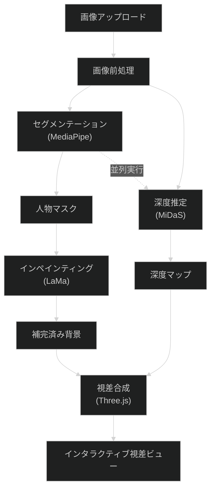

# 処理パイプライン詳細

最終更新日: 2026-01-07

## 1. パイプライン概要図



---

## 2. Step 1: 画像前処理

**責務**: アップロードされた画像を処理に適した形式に変換

**入力**:

- ユーザーがアップロードした画像ファイル (JPEG/PNG/WebP)

**処理内容**:

1. **EXIF回転補正**: スマートフォン撮影画像の向きを正規化
2. **リサイズ**: 最大辺を1024pxに制限（モバイル対応）
3. **ImageData変換**: Canvas APIでRGBA形式に変換
4. **バリデーション**: ファイルサイズ・形式チェック

**出力**:

```typescript
interface ProcessedImage {
  imageData: ImageData;      // RGBA形式の画像データ
  originalWidth: number;     // 元の幅
  originalHeight: number;    // 元の高さ
  processedWidth: number;    // 処理後の幅
  processedHeight: number;   // 処理後の高さ
}
```

**実装ファイル**: `src/services/image/ImageUtils.ts`

---

## 3. Step 2: セグメンテーション

**責務**: 画像から人物・物体を切り出すマスクを生成

**使用モデル**: MediaPipe Image Segmenter

- モデルサイズ: 454KB (selfie_multiclass_256x256.tflite)
- 推論時間: ~30ms (デスクトップ) / ~100ms (モバイル)

**入力**:

- `ImageData` (Step 1の出力)

**処理内容**:

1. MediaPipe Image Segmenterの初期化
2. 画像の前処理（正規化）
3. セグメンテーション推論
4. マスクの後処理（エッジスムージング）

**出力**:

```typescript
interface SegmentationResult {
  foregroundMask: ImageData;  // 前景（人物）マスク（白=前景）
  backgroundMask: ImageData;  // 背景マスク（白=背景）
  confidence: Float32Array;   // ピクセルごとの信頼度
}
```

**Web Worker**: `src/workers/segmentation.worker.ts`

**コード例**:

```typescript
// segmentation.worker.ts
import { ImageSegmenter, FilesetResolver } from '@mediapipe/tasks-vision';

let segmenter: ImageSegmenter | null = null;

async function initializeSegmenter(): Promise<void> {
  const vision = await FilesetResolver.forVisionTasks(
    '/models/segmentation/wasm'
  );
  segmenter = await ImageSegmenter.createFromOptions(vision, {
    baseOptions: {
      modelAssetPath: '/models/segmentation/selfie_multiclass_256x256.tflite',
      delegate: 'GPU'
    },
    outputCategoryMask: true,
    outputConfidenceMasks: true
  });
}

async function segment(imageData: ImageData): Promise<SegmentationResult> {
  if (!segmenter) await initializeSegmenter();

  const result = segmenter.segment(imageData);
  // マスク処理...
  return { foregroundMask, backgroundMask, confidence };
}
```

---

## 4. Step 3: 深度推定

**責務**: 単眼画像から相対深度マップを生成

**使用モデル**: MiDaS v2.1 small (ONNX)

- モデルサイズ: ~20MB
- 入力サイズ: 256x256
- 推論時間: ~200ms (WebGL) / ~500ms (WASM)

**入力**:

- `ImageData` (Step 1の出力)

**処理内容**:

1. ONNX Runtimeの初期化（WebGPU優先、WASMフォールバック）
2. 画像の前処理（リサイズ、正規化）
3. MiDaS推論
4. 深度マップの後処理（正規化0-1）

**出力**:

```typescript
interface DepthEstimationResult {
  depthMap: Float32Array;     // 正規化深度（0=近い、1=遠い）
  width: number;
  height: number;
  minDepth: number;           // 最小深度値
  maxDepth: number;           // 最大深度値
}
```

**Web Worker**: `src/workers/depth.worker.ts`

**コード例**:

```typescript
// depth.worker.ts
import * as ort from 'onnxruntime-web';

let session: ort.InferenceSession | null = null;

async function initializeDepthModel(): Promise<void> {
  // WebGPU優先、WASMフォールバック
  const providers = ['webgpu', 'wasm'];
  session = await ort.InferenceSession.create(
    '/models/depth/midas_v21_small.onnx',
    { executionProviders: providers }
  );
}

async function estimateDepth(imageData: ImageData): Promise<DepthEstimationResult> {
  if (!session) await initializeDepthModel();

  // 前処理: 256x256にリサイズ、正規化
  const inputTensor = preprocessForMiDaS(imageData);

  // 推論
  const results = await session.run({ input: inputTensor });
  const depthMap = results.output.data as Float32Array;

  // 後処理: 0-1に正規化
  return normalizeDepthMap(depthMap, imageData.width, imageData.height);
}
```

---

## 5. Step 4: インペインティング

**責務**: 前景を除去した背景部分を自然に補完

**使用モデル**: LaMa (Large Mask Inpainting)

- FP32モデル: ~208MB（高品質、デスクトップ向け）
- INT8モデル: ~52MB（軽量、モバイル向け）
- 入力サイズ: 512x512

**入力**:

- `ImageData` (Step 1の出力)
- `foregroundMask` (Step 2の出力)

**処理内容**:

1. ONNX Runtimeの初期化
2. 画像とマスクの前処理（512x512にリサイズ）
3. LaMa推論
4. 結果を元のサイズにリサイズ

**出力**:

```typescript
interface InpaintingResult {
  inpaintedImage: ImageData;  // 補完済み背景画像
  processingTime: number;     // 処理時間（ms）
}
```

**Web Worker**: `src/workers/inpainting.worker.ts`

**コード例**:

```typescript
// inpainting.worker.ts
import * as ort from 'onnxruntime-web';

let session: ort.InferenceSession | null = null;

async function initializeLaMa(quality: 'high' | 'balanced'): Promise<void> {
  const modelPath = quality === 'high'
    ? '/models/inpainting/lama_fp32.onnx'
    : '/models/inpainting/lama_int8.onnx';

  const providers = quality === 'high' ? ['webgpu', 'wasm'] : ['wasm'];
  session = await ort.InferenceSession.create(modelPath, {
    executionProviders: providers
  });
}

async function inpaint(
  image: ImageData,
  mask: ImageData
): Promise<InpaintingResult> {
  if (!session) await initializeLaMa('balanced');

  // 512x512にリサイズ
  const [imageInput, maskInput] = preprocessForLaMa(image, mask);

  // 推論
  const startTime = performance.now();
  const results = await session.run({
    image: imageInput,
    mask: maskInput
  });
  const processingTime = performance.now() - startTime;

  // 元のサイズに戻す
  const inpaintedImage = postprocessLaMa(results.output, image.width, image.height);

  return { inpaintedImage, processingTime };
}
```

---

## 6. Step 5: 視差合成・表示

**責務**: 前景・背景・深度マップを組み合わせて視差効果を生成

**使用技術**: Three.js + React Three Fiber

**入力**:

- `foregroundImage`: マスク適用済み前景
- `inpaintedBackground`: 補完済み背景
- `depthMap`: 深度マップ

**処理内容**:

1. Three.jsシーンの構築
2. 前景・背景をテクスチャとして配置
3. 深度マップをDisplacement Mapとして適用
4. ポインター追従による視差効果

**視差効果の実装**:

```typescript
// ThreeScene.tsx
import { useFrame, useThree } from '@react-three/fiber';
import { useRef } from 'react';
import * as THREE from 'three';

interface ParallaxLayerProps {
  texture: THREE.Texture;
  depthMap: THREE.Texture;
  depth: number;  // レイヤーの深度（0=最前面、1=最背面）
  parallaxIntensity: number;
}

function ParallaxLayer({ texture, depthMap, depth, parallaxIntensity }: ParallaxLayerProps) {
  const meshRef = useRef<THREE.Mesh>(null);
  const { pointer } = useThree();

  useFrame(() => {
    if (!meshRef.current) return;

    // ポインター位置に応じてオフセット
    const offsetX = pointer.x * parallaxIntensity * depth;
    const offsetY = pointer.y * parallaxIntensity * depth;

    meshRef.current.position.x = offsetX;
    meshRef.current.position.y = offsetY;
  });

  return (
    <mesh ref={meshRef} position={[0, 0, -depth]}>
      <planeGeometry args={[1, 1, 64, 64]} />
      <meshStandardMaterial
        map={texture}
        displacementMap={depthMap}
        displacementScale={0.1 * depth}
        transparent
      />
    </mesh>
  );
}
```

**インタラクション**:

- **デスクトップ**: マウス位置追従
- **モバイル**: タッチドラッグ、ピンチズーム対応

**出力**:

- インタラクティブな視差ビュー（Canvas要素）
- エクスポート機能（静止画/動画）
