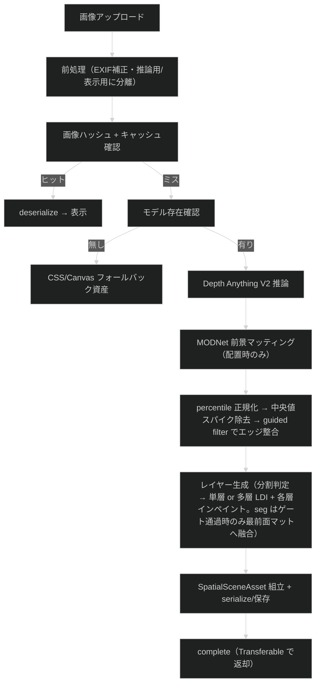
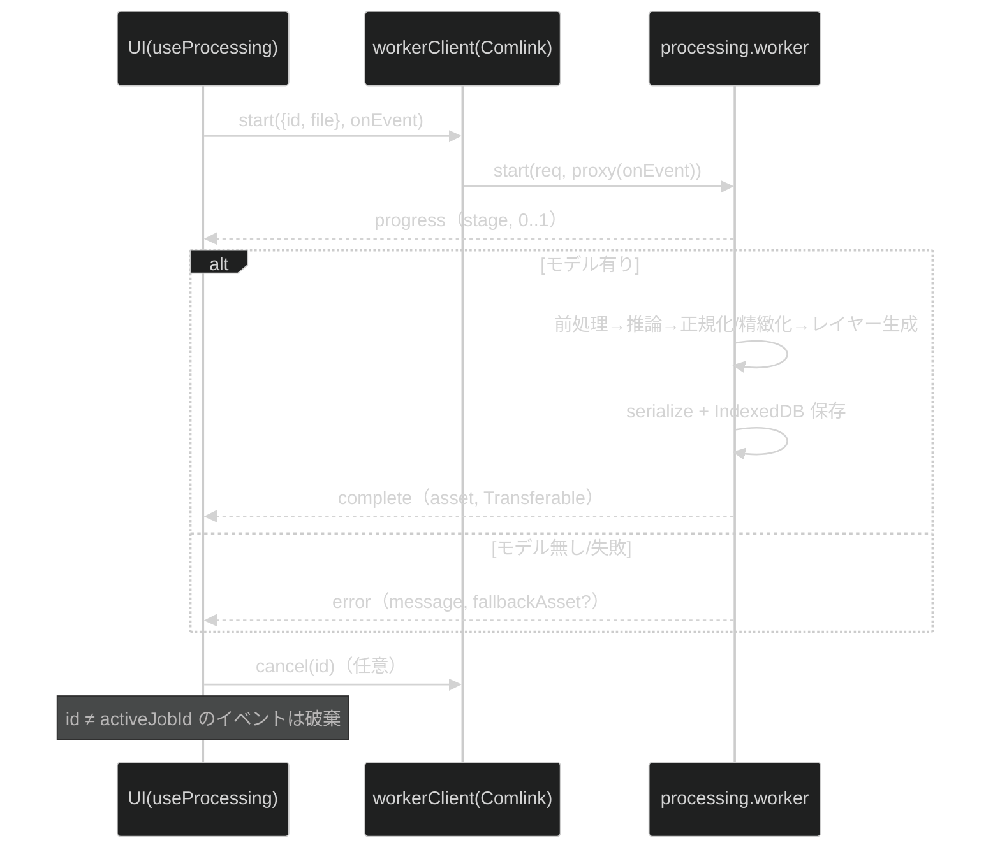
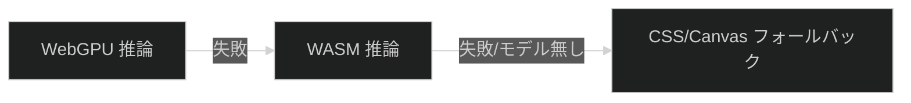

# 処理パイプライン詳細

最終更新日: 2026-07-09

## 1. パイプライン概要（実装ガイド §4）

## 2. ステージ（`ProcessingStage`, 実装ガイド §20）

`preprocessing-image` → `loading-model` → `estimating-depth` → `normalizing-depth` → `building-mesh`（レイヤー生成）→ `finalizing`。各ステージ境界でキャンセルを確認する（前処理・ハッシュ算出を先に行い、キャッシュミス時のみモデルをロードする）。seg 用の進捗ステージは追加せず、seg モデルのダウンロードは `loading-model`、seg 推論は `estimating-depth` の後半で行う。モデルダウンロード中・深度/seg 推論中・`buildLayers` 内部にはチェックポイントがなく、キャンセル反映はそれらの完了後になる。

## 3. main ↔ worker データフロー

- **Transferable**: 深度 `Float32Array`、メッシュ `positions/uvs/indices`、`ImageBitmap` を `Comlink.transfer` でゼロコピー返却（`utils/transfer.ts`）。保存(serialize)は転送前にコピーで実施。
- **キャンセル**（実装ガイド §20）: 推論自体は中断できないが、後続ステージを打ち切り、main 側は `id !== activeJobId` のイベントを破棄する（single-flight）。

## 4. 深度推定（実装ガイド §9/§10）

- 入力 `pixel_values` `[1,3,H,W]` float32 NCHW RGB、ImageNet 正規化。ONNX は動的軸対応のため**アスペクト比を保持**し、長辺を tier 別 `IMAGE_LIMITS[tier].depthSide`（mobile 392 / desktop 686）・両辺を 14 の倍数にスナップして推論する（`inferenceDims`）。tier の depthSide は estimator の `load` へ `inputSide` として渡され、モデル既定値（518）より優先される。前処理（`preprocessImage`）が推論寸法へ直接リサイズし、二重リサンプルを避ける。
- 出力 `predicted_depth` `[1,H,W]`。Depth Anything V2 は「大きい=近い」を出力するため、`normalizeDepth` の規約（0=far/1=near）と一致し既定では反転しない。
- 正規化は percentile（0.02/0.98）、range 下限 1e-6 でゼロ除算回避。
- 正規化後、深度後処理を 2 段適用する（破綻低減）:
  - `medianDepth`: 中央値フィルタで孤立スパイク（葉むら等の高周波ノイズが手前へ飛ぶ「浮遊断片」の原因）を除去。半径 1 を `medianPasses` 回反復し、細部を潰さずに 2px 級のスパイク塊まで落とす。
  - `refineDepth`: カラーガイド版 guided filter（`guidedFilterColor`）で推論画像の RGB をガイドに、深度エッジを実シルエットへ整合させつつ平坦部を平滑化。輝度が同じで色相だけ異なる境界も識別できる。ガイドは推論用画像を深度と同寸へ描画した RGB planar（`rgbPlanesFromImageData`）。
- バックエンドは `webgpu` で `InferenceSession.create` を試み、失敗時 `wasm`（`resolveOnnxBackend`）。

## 5. レイヤー生成（実装ガイド §13/§14）

遮蔽で生じる穴を根本解消するため、refined 深度を 1〜`maxLayers` 層（tier 別: mobile 3 / desktop 4）の Layered Depth Image に分けて描画する（`buildLayers`）。

- **分割判定**: `splitDepthLayers` が**再帰的 Otsu**（区間限定 Otsu の貪欲 best-first 二分割）でレイヤー境界しきい値 t_1 < … < t_{K-1} と、各しきい値の累積 near 側ソフトマスク M_k を求める。分割候補は次のゲートをすべて通過した場合のみ採択される:
  - **にじみ帯 veto**: 遷移帯（±`splitMargin`）内の質量 ≤ `maxBandMassRatio`。遷移帯の画素は中間アルファになり、静止時も下層インペイントと混ざって幅広い「にじみ帯」として見えるため、連続的な奥行きを横切る分割（帯質量が多い）は η によらず棄却する。
  - **分離度 η または谷の空虚度**: 区間内 η（クラス間分散/全分散）≥ `minSplitSeparability`、**または**遷移帯の質量 ≤ `emptyBandMassRatio`。3 モード以上の分布では最初の二分割の η が本質的に下がる（別モードがクラス内分散を膨らませる）ため、谷が実質空なら η が低くても分割を許す OR 条件にしている。
  - **スラブ質量**: 分割後の両側質量 ≥ `minSlabMassRatio`（前景が全画面/皆無の退化分割と極小層の乱立を防ぐ）。
  - **間隔**: 隣接しきい値・深度端との距離 ≥ `minSlabDepthSpan`（smoothstep 遷移帯の重なりを防ぐ）。
  採択ゼロ（深度が連続的な風景等）は分割せず、不連続カリング付きの**連続メッシュ 1 枚（単層）**へフォールバックする（「一枚の面が裂ける」破綻を防ぐ）。カリングで三角形が落ちた場合のみ、不連続の手前側（`discontinuityNearMask`）を穴としてインペイントした**バックドロップ層**を奥に敷き（多層時の最背面と同じ構成、Z ファイティング回避に `backdropZOffset` 分奥へ）、穴の背後の背景色露出を防ぐ。1 枚も落ちなければ追加コストなしで単層のまま。
- **N 層の統一スキーム**: レイヤー k = 「t_{k+1} より手前（M_{k+1}）を穴としてインペイントした画像」を M_k でマットしたもの。
  - **最背面**: 全ての手前領域を除去し `pushPullInpaint`（マスク付き push-pull）で色・深度をインペイントした「完全な背景」。カリング無しの完全メッシュなので手前がずれても穴が出ない。**外周ガター**（`bgGutter`、インペイント余白 + メッシュ位置への焼き込み）を持ち、視差移動時のフレーム外露出を防ぐ（単層シーンも同様）。
  - **中間層**: 自スラブの切り抜きに加え、さらに手前の領域を自スラブの延長色で穴埋めする（露出時に奥の色でなく自スラブの色が見える）。1 回の push-pull を穴埋めと色デコンタミネーションで共用する。
  - **最前面**: 被写体の切り抜き（穴なし）。
- **seg 融合（MODNet 配置時のみ）**: 深度は「距離」、seg は「被写体」概念のため、`segmentationGate` が整合を確認してから**最前面の累積マスクにのみ**融合する（`fuseMatte`）。ゲートは①面積比（0.04〜0.7）②ソフト率 ≤0.35（低信頼マスク除外）③深度整合（seg 内外の深度中央値差 ≥0.12。柵・ガラス越しを除外）④深度前面との IoU（≥0.7 で strong / ≥0.45 で band / 未満は不採用）。strong は `min(seg, dilate(bin(cum)))` で seg のシルエットを採用（同一深度帯の非被写体は下の層へ）、band は遷移帯のみ seg で矯正。許容拡張半径は `inpaintDilate` の深度解像度換算に抑え、下層の穴が覆えない領域への拡張（ゴースト）を防ぐ。差し替え後は中間層の穴も融合済みマスクを参照するため表示と穴が整合する。モデル未配置・推論失敗・ゲート不採用のいずれでも深度のみマットで続行し、適用状況は `metadata.segmentation`（PerfBadge に表示）へ記録する。
- **マットのエッジ整合アップサンプリング**: 深度解像度のマスクはテクスチャ解像度へ双線形拡大後、guided filter（`upsampleMatte`）で実シルエットへ吸着させる。アルファマットは色相境界にも吸着できるカラーガイド、穴マスクは直後に膨張・2 値化されるため輝度ガイド（コスト削減）。
- **マットレイヤー共通**: アルファは 2px チョーク（`erodeMin`, `fgAlphaErode`）で混合画素を削り、エッジ帯の RGB はスラブ内部色の押し出し（push-pull による**色デコンタミネーション**）で奥の色の焼き込みを除去する。メッシュは累積マスク M_k でカリングし、自スラブの帯（M_k の near 側かつ M_{k+1} の far 側）を known とした push-pull でマスク外の深度置換（**スカート平坦化**）と穴内の深度延長を同時に行い、境界三角形が奥の深度へ引き伸ばされる「膜」を防ぐ。テクスチャは straight alpha（`premultiplyAlpha: "none"` 明示）。
- テクスチャは全レイヤーとも display と同解像度（tier の `textureSide` でキャップ済み）。最背面/中間層だけ解像度を落とすと静止時から画面の大半がぼけて見えるため揃えている。
- 最背面ジオメトリの深度置換範囲（穴）は、色インペイントの穴マスクを max プーリングで深度解像度へ縮小 + 1px 膨張して導出する。「色を置換した範囲 ⊆ 深度を far へ置換した範囲」が保証され、インペイント色が前景深度のまま浮く「膜」を防ぐ。
- 格子は tier 別 `IMAGE_LIMITS[tier].meshGrid`（mobile 128 / desktop 256）。z = 深度 × `PIPELINE_DEFAULTS.depthScale`。全レイヤーを同一 depthScale で配置し、視差は Z 差から自然に生じる。

## 6. フォールバック連鎖（実装ガイド §23）

WebGPU→WASM 降格は `resolveOnnxBackend`（`DepthEstimator` の `backend:'auto'`）が `InferenceSession.create` の成否で担う（§4）。モデル未配置・推論失敗時は `layers` 空の資産を返し、UI が `CssFallbackViewer`（元画像 + blur 背景）を表示する。

## 7. レンダリングとドラッグ（実装ガイド §18/§19）

- `LayeredRenderer`: 最背面（不透明・外周ガターはメッシュに焼き込み済み）+ 中間/最前面（アルファ）の複数深度メッシュを 1 カメラで描画（任意レイヤー数対応）。単層資産（レイヤー 1 枚）もそのまま描画できる。テクスチャはミップマップ + 異方性フィルタ有効（ドラッグ中のシャギー/モアレ防止）。資産差し替え時に旧リソースを `dispose`。
- `DragCameraController`: Pointer Events でカメラを**平行移動のみ**（回転なし）でオフセットし（`maxOffset` 0.13, `smoothing` 0.12）、**off-axis projection**（非対称視錐台）で z=0 の画像面を画面に固定する。lookAt 回転による台形歪み・絵全体の泳ぎを避け、視差を純粋な奥行きとして見せる。release で中心へイージング。ジャイロ不使用。
- Depth スライダーはメッシュ z スケール、Parallax スライダーはカメラ最大オフセットのスケール、Reset は中心復帰要求。
